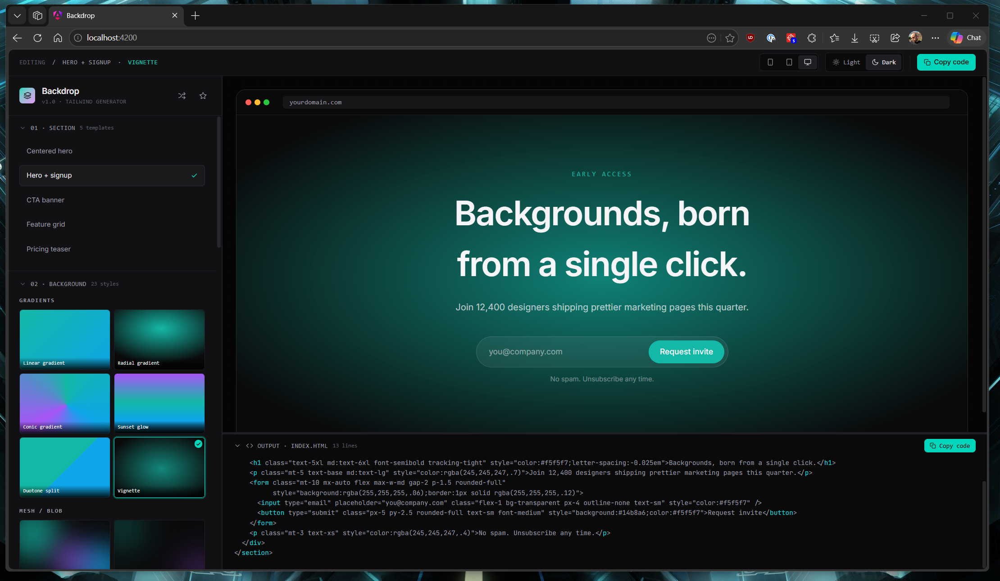
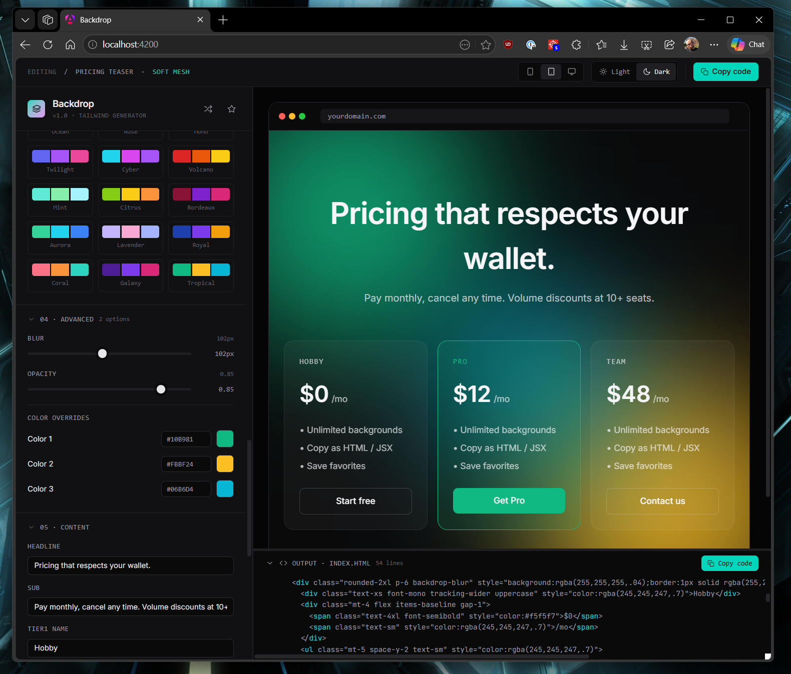

# Backdrop

See it live at <a href="https://backdrop.usualexpat.com/" target="_blank">https://backdrop.usualexpat.com/</a>
A Tailwind background generator and section gallery. Pick a section template, drop a background underneath it, tweak the palette and sliders until it looks right — then copy a single self-contained HTML + Tailwind snippet into your own project. No build step, no dependencies, no editing strangers' source.



## What you get

- **Section templates** — hero, hero + signup, CTA banner, feature grid, pricing teaser. The thing your landing page actually needs.
- **23 backgrounds** across four families:
  - *Gradients* — linear, radial, conic, sunset, duotone split, vignette
  - *Mesh / blob* — soft mesh, corner glow, top spotlight, center halo
  - *Patterns* — grid, dots, diagonals, cross-hatch, checkerboard
  - *Animated* — drifting blobs, aurora wave, grid scan, cursor spotlight, pulsing orbs, conic spin, shimmer dots, hue shift
- **18 curated palettes** — Teal, Sunset, Forest, Ocean, Twilight, Cyber, Galaxy, Coral, and more. One click swaps every color across your section and background.
- **Live preview** with desktop, tablet, and mobile viewports plus a light/dark toggle.
- **Randomise** — surprise yourself with a fresh background + palette pairing.
- **Favourites** — save combinations you like and recall them later.
- **Copy code** — generates a clean self-contained snippet (any required `@keyframes` are inlined) ready to paste anywhere Tailwind runs.



## Customise everything

Each background exposes its own controls — blur radius, opacity, animation duration, gradient angle, pattern spacing, vignette intensity. Palette colors apply automatically, but every layer also has a **color override** in case you want to deviate from the global palette. Section content (headlines, subheads, CTA labels) is editable inline.

## Development server

To start a local development server, run:

```bash
ng serve
```

Once the server is running, open your browser and navigate to `http://localhost:4200/`. The application will automatically reload whenever you modify any of the source files.

## Code scaffolding

Angular CLI includes powerful code scaffolding tools. To generate a new component, run:

```bash
ng generate component component-name
```

For a complete list of available schematics (such as `components`, `directives`, or `pipes`), run:

```bash
ng generate --help
```

## Building

To build the project run:

```bash
ng build
```

This will compile your project and store the build artifacts in the `dist/` directory. By default, the production build optimizes your application for performance and speed.

## Running unit tests

To execute unit tests with the [Vitest](https://vitest.dev/) test runner, use the following command:

```bash
ng test
```

## Running end-to-end tests

For end-to-end (e2e) testing, run:

```bash
ng e2e
```

Angular CLI does not come with an end-to-end testing framework by default. You can choose one that suits your needs.

## Additional Resources

For more information on using the Angular CLI, including detailed command references, visit the [Angular CLI Overview and Command Reference](https://angular.dev/tools/cli) page.
